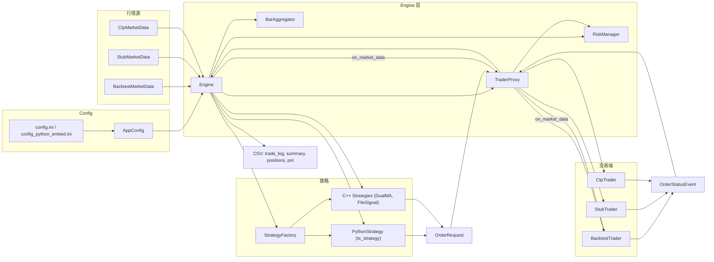

# FuturesForge期货量化交易系统（C++ / CTP）

本项目是一个使用 C++ 开发、可接入 CTP 接口的期货量化交易系统骨架。默认提供 Stub 行情/交易以便在没有 CTP SDK 的情况下也能本地演示事件驱动流程；启用 `USE_CTP=ON` 后，可编译真实 CTP 封装（需要本机安装 CTP SDK）。

## 目录结构
```
FuturesForge/
├─ CMakeLists.txt
├─ include/TradingSystem/
│  ├─ Event.h
│  ├─ IMarketData.h
│  ├─ ITrader.h
│  ├─ Strategy.h
│  └─ Engine.h
├─ src/
│  ├─ core/Engine.cpp
│  ├─ stub/
│  │  ├─ StubMarketData.h
│  │  ├─ StubMarketData.cpp
│  │  ├─ StubTrader.h
│  │  └─ StubTrader.cpp
│  ├─ ctp/  (仅 USE_CTP=ON 编译)
│  │  ├─ CtpMarketData.h
│  │  ├─ CtpMarketData.cpp
│  │  ├─ CtpTrader.h
│  │  └─ CtpTrader.cpp
│  └─ main.cpp
```

## 架构图


## 构建与运行（Stub 演示）
1. 生成构建文件：
   - 在项目根目录执行：
     ```
     cmake -S . -B build
     ```
2. 编译：
   ```
   cmake --build build --config Release -j 4
   ```
3. 运行：
   - 可执行文件位于 `build/bin/`（部分生成器会使用 `build/bin/Release/`）。运行：
     ```
     build\bin\trade_app.exe
     ```
   - 程序会打印 Stub 行情与策略触发的下单/成交日志，约运行 20 秒后退出。

## 启用 CTP 接入
1. 准备 CTP SDK：
   - 将 CTP SDK 的 `include/` 与 `lib/` 放在某目录（例如 `e:\SDKs\CTP`）。
   - 常见库名：
     - 模拟盘：`thostmduserapi_se.lib`, `thosttraderapi_se.lib`
     - 实盘：`thostmduserapi.lib`, `thosttraderapi.lib`
2. 配置 CMake 选项：
   - 设置环境变量 `CTP_SDK_DIR` 指向 SDK 根目录，或在 CMake 时传入：
     ```
     cmake -S . -B build -DUSE_CTP=ON -DCTP_SDK_DIR=e:\SDKs\CTP
     ```
3. 编译：
   ```
   cmake --build build --config Release -j 4
   ```
4. 运行：
   - 修改 `main.cpp` 中 `AppConfig` 为真实前置、资金账号、密码、合约等。
   - 运行同上。

> 说明：CTP 接入使用 `ThostMDUserApi.h` / `ThostTraderApi.h`。如你的 SDK 使用不同大小写或路径，确保包含路径正确。

## 开发说明
- 架构分层：
  - `IMarketData`/`ITrader` 抽象接口，Stub 与 CTP 封装均实现这些接口。
  - `Engine` 负责连接、登录、订阅，并将行情事件分发给 `Strategy`；策略可调用交易接口下单。
  - `Strategy` 示例实现为 `PrintStrategy`，输出行情并在价格超阈值时示意下单。
- 扩展建议：
  - 策略框架：新增 `on_order_status`、`on_bar` 等回调，更丰富的事件类型。
  - 风控模块：开仓限额、止损止盈、断线重连、交易时段控制。
  - 持仓与账户：实时查询与内存账本一致性校验。
  - 日志与持久化：滚动日志、关键事件落盘。

## 回测模式（逐 Tick 撮合）
- 构建：默认已包含 `BacktestMarketData.cpp` 与 `BacktestTrader.cpp`，无需额外选项。
- 运行：编辑 `config.ini` 设置回测与数据路径：
  - `mode=backtest`
  - `backtest_file=data/ticks.csv`
  - `backtest_meta=data/meta.json`
  - `backtest_rules=data/config.json`
  - `instruments=` 留空表示订阅全部合约。
- 行情 CSV：支持常见逐 Tick 格式（包含 `bid/ask/bid_vol/ask_vol/last` 与时间戳、合约字段）。
- 规则与元数据：
  - `meta.json`（逐合约）：`tick_size`、`contract_multiplier`、`slippage_tick`。
  - `config.json`（全局）：`slippage_tick` 与 `partial_fill`。
- 部分成交语义：
  - 当 `partial_fill=false` 且订单类型不是 `IOC` 时，仅在当前 Tick 可用量足以完全成交时才撮合；否则跳过该 Tick。
  - `FOK` 在下单时校验能否全成，不满足则直接拒绝；`IOC` 允许部分成交，剩余立即取消。
- 订单状态事件：`OrderStatusEvent` 现新增结构化字段：`instrument`、`filled_qty`、`fill_price`、`remaining_qty`，同时保留原 `msg` 文本，便于下游直接读取成交与剩余量信息。
- 示例运行：
  - 构建：`cmake --build build --config Release -j 4`
  - 运行：`build\\bin\\trade_app.exe`（或生成器对应的输出目录），日志会展示回放的撮合结果。

## 命令行与配置
- 指定配置文件：使用 `-c` 或 `--config`，例如：
  - `build\\bin\\trade_app.exe -c E:\\09Code\\Test\\TradeSystem\\build\\config.ini`
- 关键配置项：
  - `enable_csv_logs=true|false`：启用 CSV 报表输出。
  - `csv_dir=<目录>`：CSV 输出目录；相对路径会在启动时解析为绝对路径并打印提示，建议使用绝对路径以避免工作目录变化导致的混淆。
  - `run_seconds=<秒>`：运行时长（Stub/回测）。
- CSV 输出说明：
  - 生成 `trade_log.csv`、`trade_summary.csv`、`positions.csv`、`positions_detail.csv`、`pnl.csv`。
  - `pnl.csv` 表头：`instrument,realized_pnl,unrealized_pnl,long_open_qty,long_avg_cost,short_open_qty,short_avg_cost`。
  - 若 `pnl.csv` 被其他程序占用导致无法写入，将自动回退生成 `pnl_YYYYMMDD_HHMMSS.csv` 并在控制台提示。

## 注意事项
- 生产前请完善风控、异常处理与日志，真实环境下务必使用仿真盘充分测试。
- 不要在代码中硬编码账户与密码；建议使用环境变量或配置文件（加密存储）。
- 连接前置、交易权限与合约交易参数由各期货公司/交易所规则决定，请遵循合规要求。

## Python 策略桥接
- 支持两种方式：
  - `python_signal`：策略在 Python 端生成 `signals.csv`，由 C++ 的 `FileSignalStrategy` 读取并下单（零额外依赖）。
  - `python_embed`：原生嵌入 Python（基于 `pybind11`），策略直接在 `on_bar`/`on_market_data` 返回订单字典列表，由桥接转换为下单请求。

### 启用原生嵌入
1. 安装 `pybind11`：
   - pip 方式：`pip install pybind11`
   - vcpkg 方式：`vcpkg install pybind11`
2. 让 CMake 能找到 `pybind11`：
   - 简单方式（推荐）：CMake 会尝试自动检测 `site-packages` 下的 `pybind11`。若仍失败，传入：
     - `-Dpybind11_DIR="<Python>/Lib/site-packages/pybind11/share/cmake/pybind11"`
   - vcpkg 方式：附加 `-DCMAKE_TOOLCHAIN_FILE=C:/vcpkg/scripts/buildsystems/vcpkg.cmake`
3. 配置与编译：
   ```
   cmake -S . -B build_py -G "Ninja" -DUSE_PY_EMBED=ON -DUSE_CTP=OFF -Dpybind11_DIR="C:/Path/To/site-packages/pybind11/share/cmake/pybind11"
   cmake --build build_py --config Release
   ```
4. 配置 `config.ini`：
   ```
   strategy_type=python_embed
   python_module=ts_strategy
   python_class=MyStrategy
   python_path=E:/09Code/Test/TradeSystem/scripts
   ```
5. 运行：
   ```
   build_py\\bin\\trade_app.exe -c config.ini
   ```

### 策略接口（Python）
- 可实现以下方法：
  - `on_market_data(md: dict) -> Optional[List[dict]]`
  - `on_bar(bar: dict) -> Optional[List[dict]]`
  - `on_order_status(ev: dict) -> None`
  - （可选）`on_order_placed(order: dict) -> None`：下单后立即回调，包含 `order_id`、`instrument`、`side`、`offset`、`type`、`price`、`qty`。
  - （可选）`on_init()`：策略加载后初始化内部状态或连接外部资源。
  - （可选）`on_start()`：引擎订阅行情并进入运行态后调用一次，用于预热/加载模型/下初始单。无参数。
  - （可选）`on_stop()`：引擎退出前调用一次，用于释放资源/保存状态。无参数。
- 返回的订单字典字段：`instrument`、`side`(`Buy`/`Sell`)、`offset`(`Open`/`Close`)、`type`(`Limit`/`Market`/`IOC`/`FOK`)、`price`、`qty`、（可选）`client_order_id`（原样回传于 `on_order_placed`）。
- 示例：`scripts/ts_strategy.py` 已提供最小策略。
+#### 订单状态事件字段（ev）
+- 基本字段：`order_id`、`status`、`message`、`instrument`、`filled_qty`、`fill_price`、`remaining_qty`
+- 额外ID（可选）：
+  - `order_ref`：交易端的订单引用（例如 CTP 的 `OrderRef`），适合配合 `FrontID/SessionID` 撤单。
+  - `order_sys_id`：交易所系统订单ID（例如 CTP 的 `OrderSysID`），适合配合 `ExchangeID` 撤单。
+- 不同渠道可能只提供其中一个或两个，策略可优先使用最稳定的ID进行追踪/撤单。
#### 撤单（可选）
- 策略在返回的列表中放入撤单字典即可：
  - `{ action: "Cancel", order_id: "<存在的订单ID>" }` 或 `{ action: "X", order_id: "<订单ID>" }`
- 桥接将调用交易端的撤单接口，其他字段忽略。
- 订单ID可通过 `on_order_placed(order)` 或 `on_order_status(ev)` 获取与记录。

> 运行时如提示找不到模块或初始化失败，控制台会打印 `[PyBridge]` 开头的错误信息，按提示修正 `python_path`、模块名或安装依赖。

## C++ 内置策略（cpp_builtin）

### 选择与配置
- 通过配置选择内置 C++ 策略：
  ```ini
  strategy_type=cpp_builtin
  builtin_class=DualMAStrategy
  strat_ma_fast=5
  strat_ma_slow=20
  strat_threshold=0.0
  ```
- 也可选择文件信号策略（同样为内置 C++）：
  ```ini
  strategy_type=cpp_builtin
  builtin_class=FileSignalStrategy
  signals_file=signals.csv    ; 可相对或绝对路径
  csv_dir=E:/09Code/Test/TradeSystem/data
  ```

### 目录与扩展
- 策略头文件：`include/TradingSystem/strategies/`
- 策略实现：`src/strategies/`
- 工厂入口：`include/TradingSystem/StrategyFactory.h` 与 `src/core/StrategyFactory.cpp`
- 注册新策略（示例）：在你的策略实现文件中加入注册代码，并在 CMake 中添加源文件。
  ```cpp
  #include "TradingSystem/StrategyFactory.h"
  #include "TradingSystem/strategies/MyStrategy.h"
  using ts::StrategyFactory;
  static bool reg = StrategyFactory::register_strategy("MyStrategy",
      [](const ts::AppConfig& cfg) {
        return std::make_unique<ts::MyStrategy>(/* 从 cfg 取参数 */);
      });
  ```
- CMake 添加源码：
  ```cmake
  target_sources(trade_app PRIVATE src/strategies/MyStrategy.cpp)
  ```

### 路径解析与提示
- `FileSignalStrategy` 会解析 `signals_file`：
  - 若包含 `:` 或 `/` 或 `\`，按绝对/已含目录路径处理；
  - 否则将其视为相对路径并拼接 `csv_dir`，最终使用 `csv_dir/signals_file`。
- 程序启动时会在控制台打印所选策略与关键参数，便于确认配置是否生效。

### 信号持久化（防重复下单）
- 策略在 `signals.csv` 同目录维护 `signals.processed.txt`（可配置文件名），每行一个已处理的 `id`。
- 加载时机：引擎进入运行态后触发 `on_start()`，自动读取并加入去重集合。
- 落盘时机：每次消费新信号后将 `id` 追加写入持久化文件；回测与实时模式均生效。
- 新增配置项：
  - `signal_persist_enable`：启用持久化逻辑总开关；关闭后不去重、不写文件。
  - `signal_persist_file`：持久化文件路径，支持绝对/相对（相对路径拼到 `signals.csv` 同目录）。
  - `signal_persist_mode`：持久化模式，取值：`none`、`dedupe`、`persist`。
  - `signal_persist_reset`：启动时重置去重状态；在 `persist` 模式下同时删除持久化文件。
- 模式语义：
  - `none`：不去重、不落盘；每个 Bar 可能重复下单（不读取 processed 文件）。
  - `dedupe`：读取已有 processed 文件进行跨次去重，但不写新条目。
  - `persist`：读取 processed 文件进行去重，并将新处理的 id 追加写入文件。
- 示例配置片段：
  ```ini
  # 仅去重不落盘
  signal_persist_enable=true
  signal_persist_mode=dedupe
  signal_persist_reset=false
  signal_persist_file=E:/09Code/Test/TradeSystem/build/data_new/signals.processed.custom.txt

  # 完整持久化
  signal_persist_enable=true
  signal_persist_mode=persist
  signal_persist_reset=false
  signal_persist_file=E:/09Code/Test/TradeSystem/build/data_new/signals.processed.txt

  # 完全关闭
  signal_persist_enable=true
  signal_persist_mode=none
  signal_persist_reset=false
  signal_persist_file=E:/09Code/Test/TradeSystem/build/data_new/signals.processed.txt
  ```
- 启动日志示例：
  - `[FileSignal] signals=... persist=on mode=dedupe reset=no file=... loaded=6`
  - `[FileSignal] signals=... persist=on mode=none reset=no file=... loaded=0`
- 重置方法：删除或清空持久化文件，或在 `signals.csv` 中使用全新的 `id`。
- 使用约束：请确保 `id` 全局唯一；若持久化文件被占用导致写入失败，策略仍会处理信号但不会记录该 `id`，请留意外部文件占用。
- 可选配置（在 `config.ini` 或运行配置中设置）：
  - `signal_persist_enable=true|false`：启用/禁用持久化与去重（默认启用）。
  - `signal_persist_file=<文件名或绝对路径>`：持久化文件名（默认 `signals.processed.txt`）。若为相对名，保存到 `signals.csv` 同目录；也可指定绝对路径。
  - `file_signal_every_n_bars=<N>`：文件信号每 N 个 Bar 处理一次（默认 `1`）。用于压力测试或限频消费。
- 命令行覆盖（便捷临时修改）：
  - 通过 `--config` 指定配置：`./bin/trade_app.exe --config config_file_signal_persist_custom.ini`
  - 覆盖模式：`--persist-mode none|dedupe|persist`，例如：`./bin/trade_app.exe -c config_file_signal_persist_custom.ini --persist-mode none`
  - 开关持久化：`--persist-enable true|false`
  - 自定义持久化文件：`--persist-file <路径>`
  - 重置：`--persist-reset`（清空内存去重集；在 `persist` 模式下会删除旧持久化文件）
  - 干跑：`--dry-run [on|off]`（省略值则启用）。启用后只打印日志，不会真实下单、不追加持久化文件。
  - 关闭干跑别名：`--no-dry-run`（显式关闭干跑，优先级与 `--dry-run` 一致，后出现者覆盖前者）。
  - 文件信号限频：`--file-signal-every <N>`（仅每 N 个 Bar 消费一次新信号；`N>=1`）。
  - 干跑影响：
    - `dedupe` 仍会加载历史 processed 文件并跳过已处理 ID，但不会新增 ID 到内存或文件。
    - 与 `--persist-reset` 同用时，仅清空内存集合，不删除旧持久化文件（无副作用）。
## Python 嵌入运行排障与环境脚本
- 现提供脚本 `tools/run_trade_app_env.cmd`，在运行前设置 `PYTHONHOME`、`PYTHONPATH` 与 `PATH`，确保加载到正确的 `python311.dll`。
- 用法：
  - 运行嵌入模式（dry-run 示例）：`tools\run_trade_app_env.cmd --dry-run -c build\config_python_embed.ini`
  - 正常运行：`tools\run_trade_app_env.cmd -c build\config_python_embed.ini`
- 若仍报错，可先运行最小嵌入自检：
  - 可执行位于 `build_py\bin\python_embed.exe`
  - 预期输出包含：`Python OK: 3.11.x ...` 与 `Embed runtime check completed successfully.`

### 常见错误与修复
- `入口点找不到 (STATUS_ENTRYPOINT_NOT_FOUND, -1073741511)`：
  - 将 `python311.dll` 与 MinGW 运行时（`libstdc++-6.dll`, `libgcc_s_seh-1.dll`, `libwinpthread-1.dll`）放在 `build_py\bin\` 同目录，避免加载到系统中不兼容版本。
  - 推荐使用 MSVC 构建版本（见下），避免 MinGW 与 MSVC（Python 官方发行版）的 ABI 兼容问题。
- `找不到模块`：检查 `config.ini` 中的 `python_path` 是否指向包含策略模块的目录（例如 `scripts/`）。
- `解释器初始化失败`：确认 `PYTHONHOME/PYTHONPATH` 指向同一版本的 Python（例如 3.11），并与 `python311.dll` 匹配。

## MSVC 构建建议（与官方 Python 一致的工具链）
- 生成 VS 解决方案：
  - `cmake -S . -B build_msvc -G "Visual Studio 17 2022" -A x64 -DUSE_PY_EMBED=ON`
- 构建 Release：
  - `cmake --build build_msvc --config Release --target trade_app`
- 运行：
  - 使用前述 `tools\run_trade_app_env.cmd` 设置 Python 环境后，执行 `build_msvc\bin\Release\trade_app.exe -c build\config_python_embed.ini`

> 运行时如提示找不到模块或初始化失败，控制台会打印 `[PyBridge]` 开头的错误信息，按提示修正 `python_path`、模块名或安装依赖。